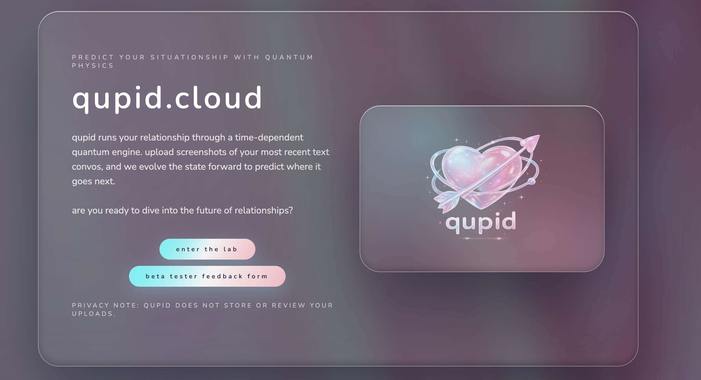
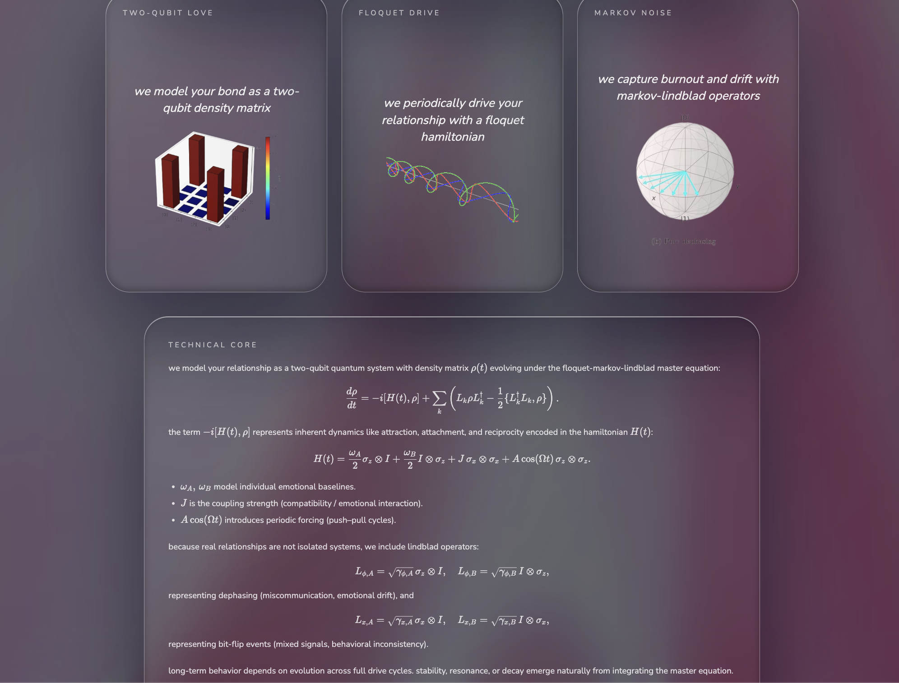
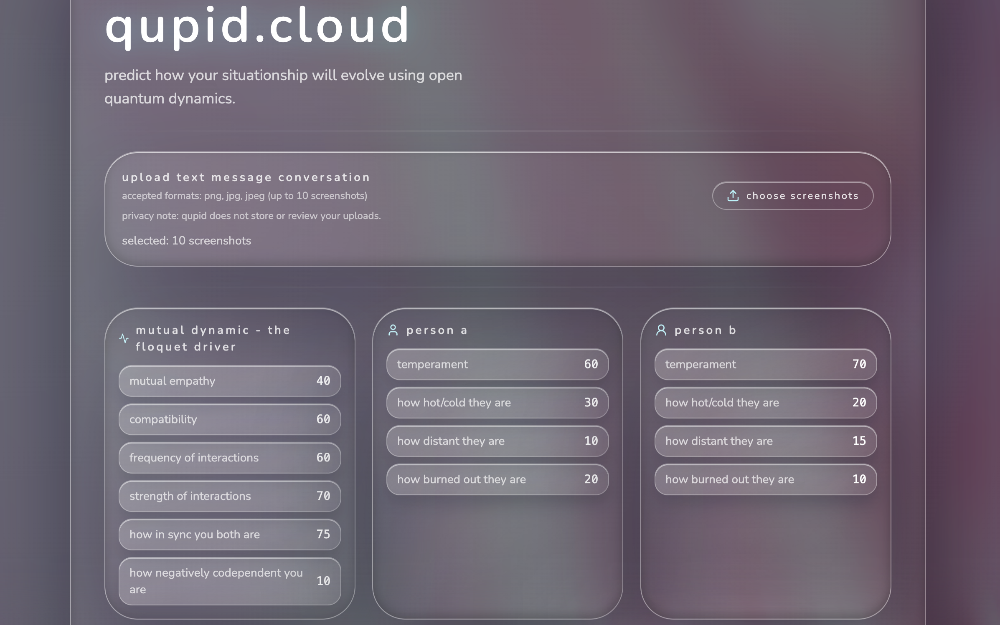
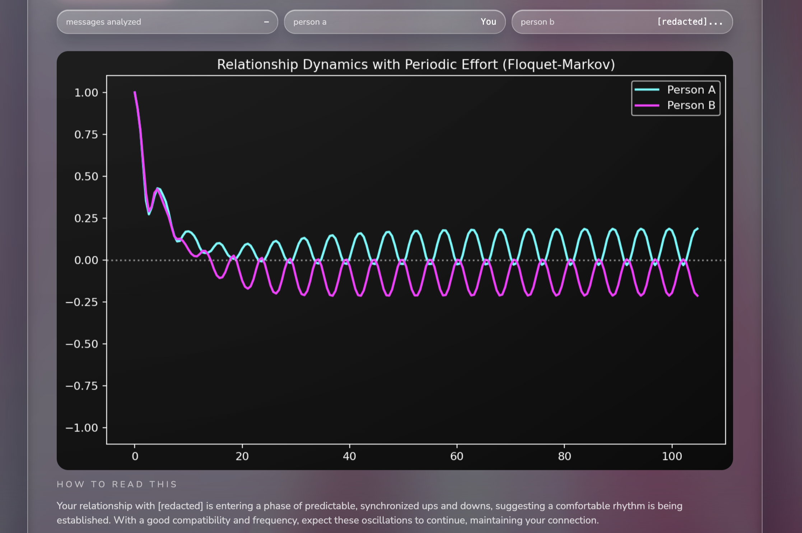
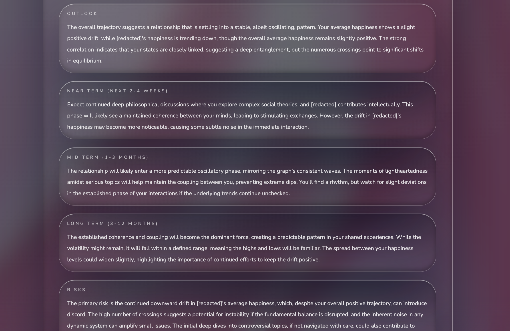

# qupid - open quantum system-inspired relationship forecasting engine 💘

Qupid is a full-stack app that runs a quantum-inspired relationship simulation. The Flask backend exposes simulation endpoints and serves a built React (Vite) frontend with a liquid-glass visual treatment.







## Quantum Backend Features

- Time-dependent, two-qubit Hamiltonian with a periodic drive (Floquet form) to model evolving dynamics.
- Empathy/compatibility couplings map to interaction terms in the Hamiltonian.
- Dissipation and noise channels modeled as Markovian Lindblad operators:
  - Bit-flip, dephasing, and decay for each partner.
  - Anti-correlated dephasing and collective decay for shared dynamics.
- Floquet-Markov solver (`fmmesolve`) in QuTiP to evolve the system across multiple drive periods.
- “Happiness” trajectories computed and graphed from expectation values of `sz` for each partner.
- Full horoscope generated from correlation, trend, and volatility signals.

## Repo Layout
- `qupid/backend`: Flask API + simulation wiring
- `qupid/qupid-app`: React + Vite frontend
- `qupid/qupid_time_dependent_floquet.py`: core simulation
- `qupid/run_script.sh`: end-to-end setup and launch script

## Quick Start
From the repo root:

```bash
./qupid/run_script.sh
```

This will:
- create a Python virtual environment
- install backend requirements
- install frontend dependencies and build the UI
- start the Flask server on `http://localhost:5000`

## Manual Setup
Backend:

```bash
cd qupid
python3 -m venv .venv
source .venv/bin/activate
python3 -m pip install --upgrade pip
python3 -m pip install -r backend/requirements.txt
python3 backend/app.py
```

Frontend:

```bash
cd qupid/qupid-app
npm install
npm run build
```

The Flask app serves the built frontend from `qupid/qupid-app/dist`.

## API Endpoints
- `POST /run`: run a simulation with JSON parameters
- `POST /analyze-run`: upload a message file and run analysis + simulation

## Notes
- The backend uses Flask + Flask-CORS.
- The frontend is a Vite React app.
